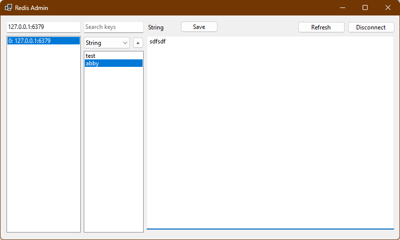

# RedisAdmin

A lightweight Windows Forms application for managing Redis databases.

## Features

- Connect to Redis servers with multiple endpoints
- Browse and search Redis keys
- View and edit different Redis data types:
  - Strings
  - Lists
  - Sets
  - Sorted Sets
  - Hashes
- Real-time value updates
- Add new keys of any supported type

## Getting Started

1. Clone the repository
2. Open the solution in Visual Studio
3. Build and run the application

## Usage

1. Enter your Redis connection string (e.g. `127.0.0.1:6379`)
2. Click "Connect" to establish connection
3. Use the search box to filter keys
4. Select a key to view/edit its value
5. Use the "+" button to add new keys
6. Click "Save" to persist changes

## Requirements

- .NET 8.0
- Windows OS
- StackExchange.Redis package

## License

This project is licensed under the Apache License 2.0 - see the [LICENSE.txt](LICENSE.txt) for details.
